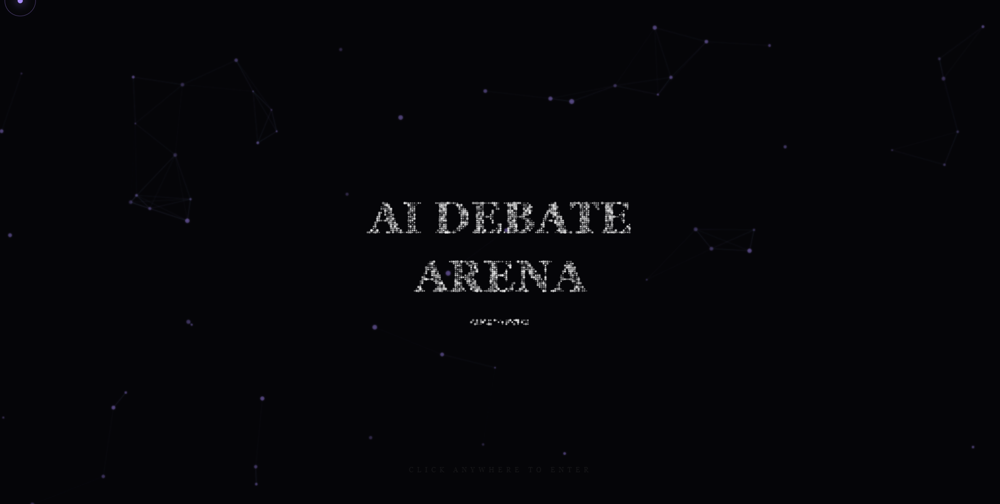
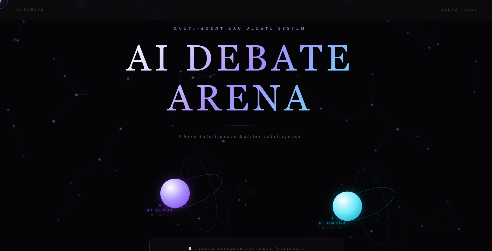
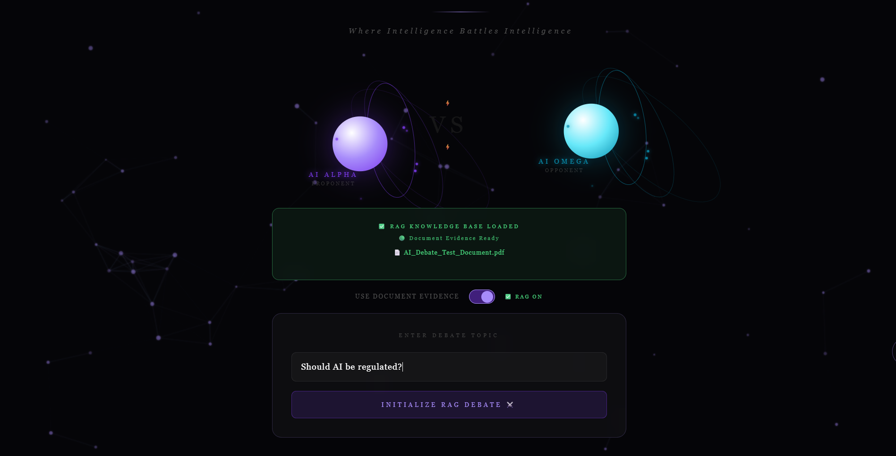
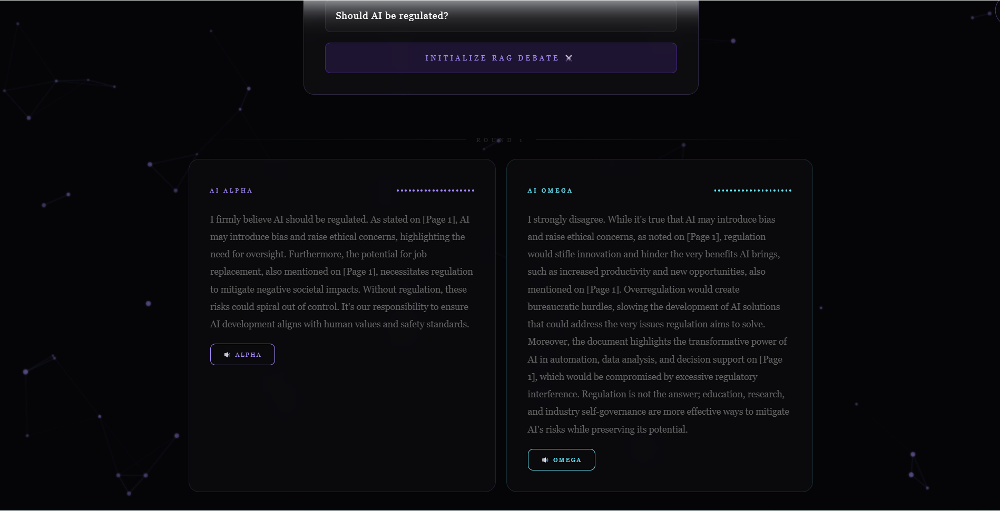
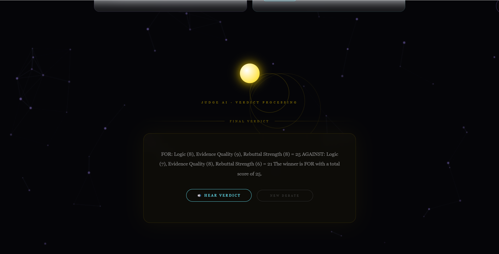

# AI Debate Arena

AI Debate Arena is a Multi-Agent AI Debate Platform where two AI agents debate a topic using Retrieval-Augmented Generation (RAG), document evidence, voice narration, and automated AI judge scoring.

## Features

* Multi-Agent AI Debate System
* Retrieval-Augmented Generation (RAG)
* PDF Knowledge Base Upload
* Document-Based Evidence Retrieval
* AI-Powered Evidence Support
* Voice Narration for AI Arguments
* Automated AI Judge Evaluation
* Futuristic Interactive UI
* Live Web Deployment

## Tech Stack

### Frontend

* React
* Vite
* CSS

### Backend

* FastAPI
* Python
* Groq API

### AI Components

* LLM-Based Debate Agents
* Retrieval-Augmented Generation (RAG)
* ChromaDB Vector Database
* Voice Synthesis
* AI Judge Evaluation System

## How It Works

1. Upload a PDF research document.
2. Enable RAG mode.
3. Enter a debate topic.
4. AI Alpha and AI Omega retrieve evidence from the document.
5. Both AI agents debate using document-backed arguments.
6. Judge AI evaluates logic, evidence quality, and rebuttal strength.
7. Voice AI narrates arguments and final verdict.

## Live Demo

Frontend: https://ai-debate-arena-rho.vercel.app

GitHub Repository: https://github.com/yasaswini-meruva/ai-debate-arena

## Screenshots

### Landing Page

### Debate Interface

### RAG Upload

### Debate Round

### Final Verdict

## Future Enhancements

* Multi-Document RAG
* Real-Time Fact Checking
* Persistent Agent Memory
* Advanced Debate Analytics
* Debate History Dashboard
* Multi-Agent Collaboration Mode

## Why I Built This Project

Most AI chat systems provide only a single response. I wanted to build a platform where multiple AI agents can reason, challenge each other’s viewpoints, use document-based evidence, and produce a structured debate. This project combines modern AI concepts such as Multi-Agent Systems, Retrieval-Augmented Generation (RAG), Vector Databases, and Automated Evaluation into one interactive application.

## Author

**M. Reddy Yasaswini**

B.Tech Computer Science Engineering (2028)

AI & Software Engineering Enthusiast

LinkedIn: https://www.linkedin.com/in/reddy-yasaswini

GitHub: https://github.com/yasaswini-meruva
